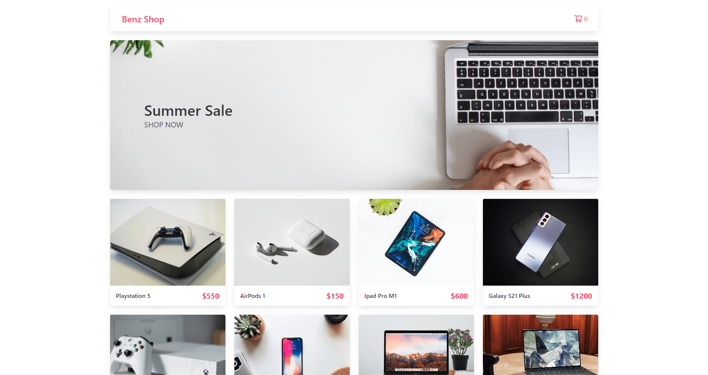

# Benz Shop

[View Live Site](https://benz-shop.vercel.app/)

An ecommerce shop built with Nextjs, Stripe, Contentful and Bulma.

## Features

- Integrate Stripe's Payment to the checkout process.
- Optimize content management with Contentful CMS.
- Implement state management with React hook createContext and useContext.

## Preview

## Tech stack

- [Next.js](https://nextjs.org/)
- [React.js](https://react.dev/)
- [Stripe](https://stripe.com/)
- [Contentful](https://www.contentful.com/)
- [GraphQL](https://graphql.org/)
- [Bulma](https://bulma.io/)

## Show your support

Give a ⭐️ if you like this project!
